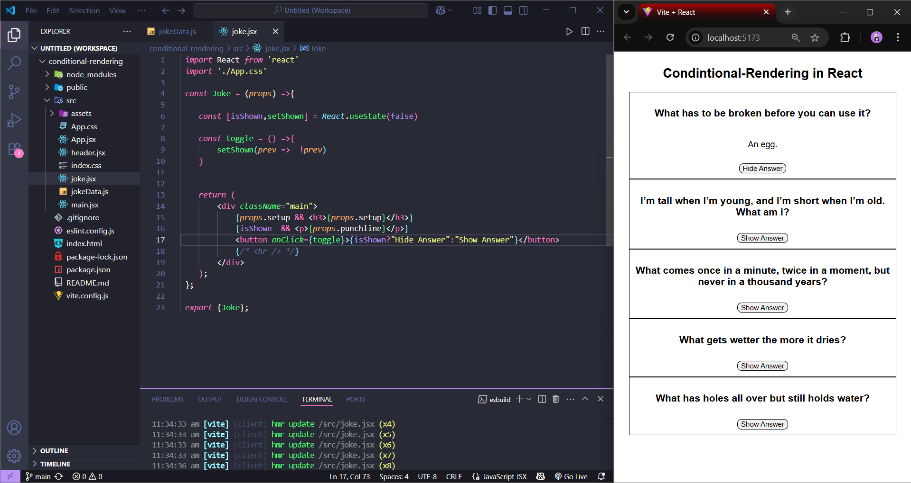

# Conditional Rendering in React

This React-based project is a simple and interactive Riddle App that displays a list of riddles fetched from a local data file. Each riddle is displayed with a "Show Answer" button that, when clicked, reveals the answer beneath it. The button then dynamically changes to "Hide Answer", allowing users to toggle the visibility of the answer. This functionality is implemented using React's useState hook and conditional rendering. Each riddle is handled by a reusable Riddle component, making the code clean, modular, and easy to scale. The project is a great example of managing component state and rendering logic in a functional React application.

Output ScreenShot

